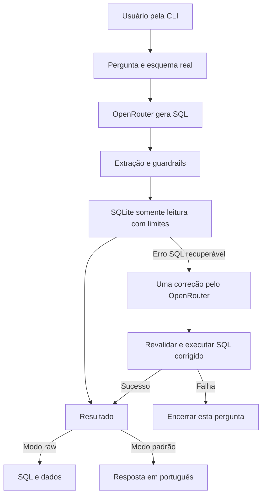

# CineData Analytics — Agente GenAI Text-to-SQL

Aplicação Python para consultar o catálogo de filmes da CineData Analytics em linguagem natural. O usuário faz uma pergunta pela linha de comando; o agente gera SQL via OpenRouter, valida a consulta, executa em SQLite somente leitura e apresenta a resposta em português.

O objetivo é permitir análises de bilheteria, avaliações, gêneros, produtoras, elenco e equipe sem exigir conhecimento de SQL. O projeto utiliza o esquema real de `cinerocket.db` e mantém SQL e resultados disponíveis para auditoria.

## Requisitos

- Python 3.11 ou superior e Git.
- O banco `cinerocket.db` fornecido pela atividade.
- Conta e chave OpenRouter para perguntas que utilizam o modelo.
- SQLite 3.35 ou superior para as duas referências que usam CTEs materializadas.

Os testes, a inspeção, a ajuda da CLI e as consultas de referência funcionam sem chave. O ambiente verificado usa Windows, Python 3.12.10 e SQLite 3.49.1. Os comandos de Linux/macOS estão documentados, mas não foram executados neste ambiente.

## Instalação

Clone o repositório e entre na pasta:

```bash
git clone https://github.com/Arturvpf/cinedata-genai-agent.git
cd cinedata-genai-agent
```

### Windows — PowerShell

```powershell
python -m venv .venv
.\.venv\Scripts\Activate.ps1
python -m pip install -r requirements.txt
Copy-Item .env.example .env
```

Se a ativação estiver bloqueada, use o executável do ambiente diretamente:

```powershell
.\.venv\Scripts\python.exe -m pip install -r requirements.txt
.\.venv\Scripts\python.exe main.py
```

Configure o banco e a chave conforme a seção seguinte antes de fazer perguntas.

### Linux/macOS

```bash
python3 -m venv .venv
source .venv/bin/activate
python -m pip install -r requirements.txt
cp .env.example .env
```

O `requirements.txt` instala o pacote local em modo editável e os testes. As versões diretas estão no `pyproject.toml`: `openai==3.24.0`, `python-dotenv==1.2.4` e `pytest==9.1.1`. Não é necessário instalar servidor de banco de dados.

## Banco e OpenRouter

Extraia o banco do ZIP da atividade e coloque-o na raiz como `cinerocket.db`. Se o arquivo extraído se chamar `cinerocket (1).db`, use uma cópia com o nome esperado ou configure `DATABASE_PATH`. Preserve o arquivo original. O banco tem aproximadamente 581 MB e permanece local, fora do Git, assim como o ZIP.

Crie uma conta no [OpenRouter](https://openrouter.ai/) e gere a chave na [página de chaves](https://openrouter.ai/keys). Depois de copiar `.env.example` para `.env`, preencha a chave localmente:

| Variável | Configuração |
| --- | --- |
| `OPENROUTER_API_KEY` | Sua chave OpenRouter; o exemplo está vazio |
| `OPENROUTER_MODEL` | Modelo escolhido; o exemplo usa `openrouter/free` |
| `DATABASE_PATH` | Caminho do banco; o exemplo usa `cinerocket.db` |

O modelo é configurável sem editar código. A integração usa o SDK OpenAI com `https://openrouter.ai/api/v1` e uma chave **OpenRouter**.

Variáveis de ambiente têm prioridade sobre o `.env`, inclusive quando estão vazias. Caminhos relativos de `DATABASE_PATH` são resolvidos contra a pasta do `.env` selecionado. A CLI lê somente o `.env` da pasta de execução por padrão; use `--env-file` para escolher outro. Não há busca em pastas superiores nem expansão de `${VAR}`.

`.env`, ambientes virtuais e bancos estão no `.gitignore`. `.env.example` é versionado sem chave. Instalação, inicialização e leitura de configuração não fazem chamadas ao modelo. A chave e os corpos de erros HTTP não são registrados nos logs.

## Execução

Na raiz do projeto, com o ambiente virtual ativo:

```bash
python main.py
```

Digite uma pergunta e pressione Enter. Para encerrar, use `sair`, `exit`, `quit` ou EOF. `Ctrl+C` interrompe a operação e fecha o cliente. Perguntas em branco são ignoradas; cada pergunta é independente, sem memória das anteriores.

### Pergunta única, raw e auditoria

```bash
python main.py --question "Quais são os cinco filmes com maior bilheteria?"
python main.py --raw --question "Quais são os cinco filmes mais populares?"
python main.py --debug --question "Quantos filmes existem no catálogo?"
python main.py --raw --debug
python main.py --help
python -m cinedata --help
```

| Opção | Efeito |
| --- | --- |
| `--question "..."` | Executa uma pergunta e encerra; sem ela, abre a sessão interativa |
| `--raw` | Mostra SQL e dados sem a chamada de redação ao modelo |
| `--debug` | Mostra pergunta, SQL, linhas, quantidade, tempo SQLite e logs das etapas |
| `--env-file CAMINHO` | Escolhe a configuração; padrão `.env` |
| `--max-rows N` | Limita as linhas, de 1 a 1000; padrão 100 |
| `--query-timeout SEGUNDOS` | Prazo por tentativa SQLite, maior que zero e até 60; padrão 5 |

Exemplo para consulta extensa e outra configuração:

```bash
python main.py --env-file "config/local.env" --raw --max-rows 20 --query-timeout 30
```

O modo padrão normalmente faz duas chamadas: geração de SQL e redação. Uma correção recuperável pode acrescentar uma chamada. `--raw` normalmente faz apenas a geração, podendo acrescentar a correção única. Resultados sem linhas recebem uma mensagem local, dispensando a redação.

Raw/debug mostra colunas e linhas na mesma ordem, preservando nomes repetidos, e representa ausência por `NULL`. Textos são abreviados após 240 caracteres e BLOBs aparecem pelo tamanho, com aviso. Controles de terminal são escapados. A exibição não é uma exportação JSON; a API Python conserva os valores completos em `AgentResult.rows`.

Na pergunta única, os códigos de saída são `0` para sucesso, `1` para falha de consulta/redação, `2` para argumentos ou inicialização inválidos e `130` para interrupção. Erros aparecem em português, sem stack traces. A sessão interativa permite outra pergunta após uma falha e retorna `0` quando encerrada voluntariamente ou por EOF.

### Exemplos de perguntas

- Quais são os dez filmes com maior receita em USD?
- Qual é o lucro médio por gênero, considerando receita e orçamento informados?
- Quais são os cinco filmes mais populares?
- Qual ator participou de mais filmes lançados nos últimos cinco anos?
- Quais diretores têm maior nota média IMDb, com pelo menos cinco filmes avaliados?
- Quantos filmes existem por gênero?
- Qual produtora tem o maior lucro total em USD?
- Quais são os dez filmes mais avaliados pelos usuários?
- Quais filmes têm maior diferença absoluta entre nota dos usuários e nota IMDb?

Esses comandos e perguntas usam a API real quando executados com chave válida. Consultas extensas de elenco/equipe podem exigir `--query-timeout 30`.

## Arquitetura



O esquema é inspecionado uma vez por sessão, incluindo colunas, PKs e FKs. O contexto de geração contém metadados, não amostras. O cliente é reutilizado e as consultas usam conexões SQLite novas, fechadas após a execução. Nenhum framework de agentes adicional é necessário para esse fluxo.

| Tecnologia | Responsabilidade |
| --- | --- |
| Python | CLI, configuração, orquestração e limites |
| SQLite via `sqlite3` | Introspecção e consultas locais somente leitura |
| OpenRouter | Acesso ao modelo configurado |
| OpenAI Python SDK | Transporte compatível com Chat Completions |
| python-dotenv | Leitura da configuração local |
| pytest | Testes com SQLite temporário e modelos/HTTP simulados |

### Estrutura do projeto

```text
cinedata-genai-agent/
├── main.py                         # Entrada da CLI
├── pyproject.toml                  # Pacote e dependências diretas
├── requirements.txt                # Instalação editável com testes
├── .env.example                    # Configuração sem segredo
├── cinerocket.db                    # Banco local, ignorado pelo Git
├── src/cinedata/
│   ├── cli.py                      # Interação e apresentação
│   ├── config.py                   # Configurações validadas
│   ├── agent.py                    # Geração, consulta, correção e resposta
│   ├── llm.py                      # Cliente OpenRouter
│   ├── prompts.py                  # Geração e correção de SQL
│   ├── answers.py                  # Contexto limitado para redação
│   ├── guardrails.py               # Validação e autorizador SQLite
│   ├── _sql_lexer.py               # Literais, comentários e tokens
│   ├── database.py                 # Conexão e execução protegida
│   ├── schema.py                   # Metadados e contexto do esquema
│   ├── inspection.py               # Contagens e amostras locais
│   ├── evaluation.py               # Perguntas e referências validadas
│   ├── models.py                   # Dataclasses imutáveis
│   └── exceptions.py               # Erros da aplicação
├── scripts/
│   ├── inspect_database.py         # Diagnóstico do banco sem API
│   └── evaluate_reference_queries.py
├── tests/
│   ├── evaluation_questions.json   # 21 perguntas, critérios e SQL
│   └── test_*.py                   # Testes automatizados
└── docs/
    ├── database.md                 # Esquema e observações dos dados
    ├── evaluation.md               # Avaliação e comparação com modelo
    └── implementation.md           # API Python e detalhes técnicos
```

## Banco e critérios de análise

O arquivo fornecido tem 95.645 filmes, dez tabelas de dados e `alembic_version`, excluída do contexto do modelo. As pontes ligam filmes a gêneros, pessoas e produtoras. Finanças, indicadores agregados e avaliações individuais referenciam os filmes por `sk_movie_id`. As nove FKs são extraídas do arquivo, sem inventar relacionamentos.

Quando a pergunta não informa moeda, o critério do agente é USD. Lucro é `receita - orçamento`. A margem percentual adotada é o retorno sobre orçamento:

```text
100.0 × (receita - orçamento) / orçamento
```

A margem exige orçamento positivo e receita não nula, com divisão protegida por `NULLIF`. Finanças ausentes não viram zero. Pedidos em BRL usam os campos BRL sem misturar moedas. Filmes com vários gêneros ou produtoras contribuem para cada grupo; não há percentuais para ratear os valores.

Papéis vêm de `dim_people.tipo_pessoa`, com valores observados `Ator`, `Diretor` e `Roteirista`. `dim_reviews` contém indicadores agregados; `movie_reviews` contém avaliações individuais. As notas observadas de usuários vão de 0 a 10. Para “últimos N anos”, usa-se uma janela móvel inclusiva até a referência; a avaliação temporal fixa uma data para reprodução.

Veja contagens, granularidade, nulos e relacionamentos em [docs/database.md](docs/database.md).

## Segurança, erros e limites

O agente aceita uma única consulta `SELECT` ou `WITH` de leitura. Bloqueia escrita, múltiplas instruções, mudanças de configuração, bancos anexados, catálogo fora do esquema e funções não permitidas. Extração, validação textual, autorizador SQLite, `mode=ro`, `query_only` e `trusted_schema=OFF` atuam em conjunto.

Há **uma única correção SQL** para erros recuperáveis de sintaxe, tabela ou coluna. O SQL corrigido passa por todas as verificações novamente. Bloqueios, timeout, recursos excedidos, falhas da API e respostas inválidas não provocam correção. O SDK não repete requisições automaticamente nem troca de modelo.

| Limite | Padrão ou teto |
| --- | --- |
| Pergunta | Até 4000 caracteres |
| SQL extraído | Até 20 mil caracteres |
| Consulta SQLite | 100 linhas e 5 s por tentativa; até 1000 linhas e 60 s |
| Conteúdo do resultado | Até 1 milhão de bytes e 100 colunas |
| Rede | Timeout de operações de 30 s; não é prazo total da pergunta |
| Contexto para redação | Até 50 linhas, textos de até 1000 caracteres e mensagens de até 50 mil caracteres |

Resultados parciais recebem avisos. Dados brutos permanecem disponíveis quando o contexto de redação é reduzido. Se a redação falhar, a CLI mostra o SQL e os dados já obtidos; a API Python mantém esse resultado em `AnswerGenerationError.result`. Resultados vazios recebem mensagem local; uma agregação com uma linha contendo zero ou `NULL` continua sendo um resultado válido.

Logs registram etapas, quantidade, tempo e classes de erros. Pergunta, SQL, valores e resposta aparecem apenas na apresentação solicitada pela CLI, não nos logs. Os métodos `generate_sql`, `query` e `ask`, as classes de erro e os detalhes técnicos estão em [docs/implementation.md](docs/implementation.md).

## Inspeção, testes e avaliação

Os comandos abaixo não fazem chamadas à API:

```bash
python scripts/inspect_database.py
python scripts/inspect_database.py --schema-only
python scripts/inspect_database.py --llm-context
python -m pytest -v
python scripts/evaluate_reference_queries.py --list
python scripts/evaluate_reference_queries.py
python scripts/evaluate_reference_queries.py --case top_receita --show-results
```

No PowerShell, sem ativar o ambiente, use `.\.venv\Scripts\python.exe` no lugar de `python`.

A inspeção mostra esquema, contagens exatas e até três amostras por tabela, com textos/BLOBs limitados. Os scripts usam o banco da raiz por padrão e aceitam `--database`; não leem `.env`. `--schema-only` evita contagens e amostras; `--llm-context` mostra somente o JSON de metadados destinado ao modelo.

A suíte usa bancos temporários e respostas simuladas, incluindo o SDK com transporte HTTP simulado. Verifica leitura, introspecção, guardrails, limites, configuração, integração, correção única, redação, CLI e referências de avaliação. Não depende de chave nem do banco da atividade.

**Validação local: 591 testes passaram.** As 21 referências executaram no banco fornecido sem falhas, sem resultados parciais e sem alterar tamanho ou data de modificação do arquivo. O histórico incremental possui mais de quinze commits reais, feitos durante as etapas do desenvolvimento.

As referências verificam SQL e critérios conhecidos; não comprovam a qualidade do modelo externo. A avaliação de uma pergunta real, conferência de resultados e reprodução da data está em [docs/evaluation.md](docs/evaluation.md). Chamadas reais ao modelo não foram feitas durante a validação automatizada.

## Limitações e diagnóstico

| Situação | Como proceder |
| --- | --- |
| Chave ausente | Preencha `OPENROUTER_API_KEY` no `.env` ou no ambiente |
| Banco não encontrado | Confira nome do arquivo e resolução de `DATABASE_PATH` |
| Erro HTTP, autenticação ou 429 | Siga a mensagem exibida; não há repetição automática |
| Consulta extensa interrompida | Avalie aumentar `--query-timeout`, até 60 s |
| Resposta parcial ou contexto reduzido | Confira os avisos e use raw/debug para inspecionar os dados |
| Pergunta ambígua ou resposta incorreta | Especifique moeda, período, nota, limiar e quantidade; revise SQL e resultados |

A qualidade de SQL e redação depende do modelo. Guardrails impedem operações não permitidas, mas não garantem que uma consulta de leitura represente a intenção do usuário. As instruções de redação não verificam automaticamente a veracidade do texto gerado.

Receitas, orçamentos e notas frequentemente estão ausentes; os resultados refletem os dados disponíveis. Modelos e provedores podem retornar erros, limites ou formatos inválidos. Consultas extensas podem exceder o prazo, e limites de conteúdo não representam um teto para toda a memória do processo. Se o esquema mudar, crie uma nova sessão para renovar os metadados.

O modelo recebe pergunta e esquema via OpenRouter; a redação também recebe uma parte limitada dos resultados. Raw dispensa apenas o envio para redação. Não há cache de respostas, memória entre perguntas ou fallback de modelo.

## Possíveis melhorias

Após avaliar a qualidade com o modelo escolhido: comparação semântica das respostas, cache, interface FastAPI ou Streamlit, gráficos e busca semântica em sinopses. Essas extensões não são necessárias para usar o projeto principal pela CLI.
